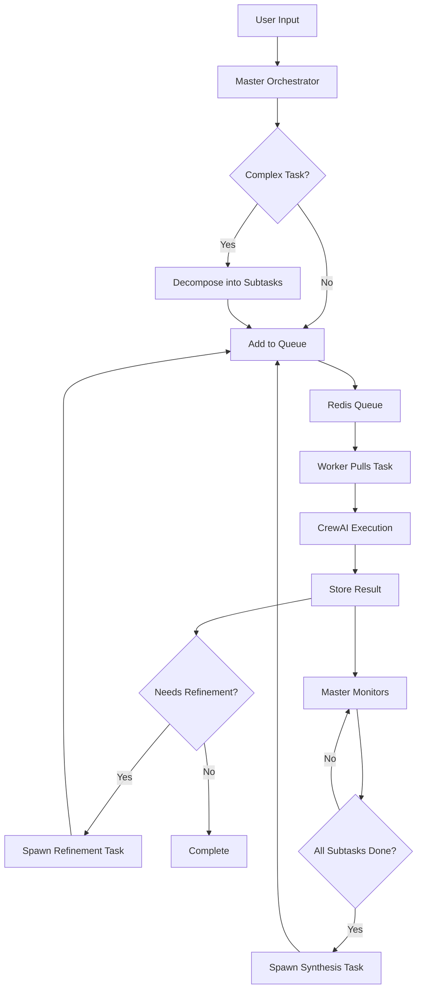

# Infinite Crew Architecture

## System Overview

Infinite Crew is a self-scaling autonomous agent system that recursively decomposes complex tasks into simpler sub-tasks, executing them in parallel using Docker-based CrewAI agents on Railway.

## Core Components

### 1. Master Orchestrator (`master/main.py`)

**Purpose**: Central brain that decomposes tasks and monitors execution.

**Key Functions**:
- `decompose()`: Uses LLM to break complex tasks into 1-4 subtasks
- `spawn_task()`: Adds tasks to Redis queue with metadata
- `monitor_loop()`: Watches for completed subtasks and spawns synthesis tasks
- `init_database()`: Sets up PostgreSQL schema

**Deployment**: Always-on Railway service

### 2. Task Queue (Redis)

**Purpose**: Distributed work queue for task distribution.

**Data Structure**:
```json
{
  "task_id": "uuid",
  "parent_id": "uuid|null",
  "prompt": "Task description",
  "depth": 0
}
```

**Operations**:
- `LPUSH tasks`: Add new task
- `BRPOP tasks`: Worker pulls task (blocking)

### 3. Result Store (PostgreSQL)

**Schema**:
```sql
CREATE TABLE results (
    id UUID PRIMARY KEY,
    parent_id UUID REFERENCES results(id),
    prompt TEXT,
    output TEXT,
    depth INT,
    created_at TIMESTAMPTZ DEFAULT now()
);
```

**Indexes**:
- `parent_id`: For hierarchy queries
- `created_at`: For time-based queries
- `depth`: For level-based analysis

### 4. Sub-Agent Workers (`worker/worker.py`)

**Purpose**: Execute individual tasks using CrewAI.

**Lifecycle**:
1. Pull task from Redis queue
2. Create CrewAI agent with task-specific configuration
3. Execute task and capture output
4. Store result in PostgreSQL
5. Optionally spawn refinement tasks
6. Exit (Railway respawns as needed)

**Scaling**: Railway automatically spawns workers based on queue depth

### 5. User Interface (`ui/app.py`)

**Purpose**: Streamlit-based control center for monitoring and launching missions.

**Features**:
- Launch new missions
- Monitor active tasks in queue
- View completed results
- Visualize task hierarchy tree
- Real-time statistics

## Task Flow



## Deployment Architecture

### Railway Services

1. **Redis**: Managed Redis instance
2. **PostgreSQL**: Managed PostgreSQL instance
3. **Master**: Always-on orchestrator service
4. **Worker**: Ephemeral Docker containers (auto-scaled)
5. **UI**: Always-on Streamlit service

### Docker Images

- **Base Worker Image**: Contains CrewAI and dependencies
- **Master Image**: Orchestration logic
- **UI Image**: Streamlit application

## Scaling Strategy

### Horizontal Scaling
- Workers scale automatically based on queue depth
- Railway spawns new containers as needed
- Each worker processes one task then exits

### Vertical Scaling
- Adjust `max_tokens` for longer outputs
- Increase worker memory for complex tasks
- Use more powerful LLM models

### Depth Control
- Maximum depth prevents infinite recursion
- Refinement only triggered for substantial outputs
- Synthesis tasks consolidate subtask results

## Configuration

### Environment Variables

```bash
# LLM Configuration
OPENAI_API_BASE=https://api.together.xyz/v1
OPENAI_API_KEY=your_key
CREWAI_MODEL_NAME=mistralai/Mixtral-8x7B-Instruct-v0.1

# Railway Injected
REDIS_URL=${{Redis.DATABASE_URL}}
DATABASE_URL=${{Postgres.DATABASE_URL}}
RAILWAY_TOKEN=your_token
RAILWAY_PROJECT_ID=your_project
```

### Railway Configuration

- **Master**: Restart policy = ALWAYS
- **Worker**: Restart policy = ON_FAILURE, max_restarts = 0
- **UI**: Restart policy = ALWAYS

## Monitoring & Debugging

### Key Metrics
- Queue depth: `redis-cli llen tasks`
- Completion rate: Query PostgreSQL `task_stats` view
- Worker logs: Railway dashboard
- Task hierarchy: UI Task Tree tab

### Common Issues

1. **Workers not starting**: Check Docker image availability
2. **Tasks stuck**: Verify LLM API credentials
3. **Slow processing**: Adjust worker scaling or model
4. **Database errors**: Check connection strings

## Future Enhancements

1. **Smart Routing**: Route tasks to specialized workers
2. **Cost Optimization**: Track and limit API usage
3. **Result Caching**: Reuse similar task outputs
4. **Multi-Model**: Use different models for different tasks
5. **Webhooks**: Notify external systems on completion
6. **Priority Queue**: Urgent tasks jump the queue
7. **Retry Logic**: Exponential backoff for failures
8. **Observability**: OpenTelemetry integration